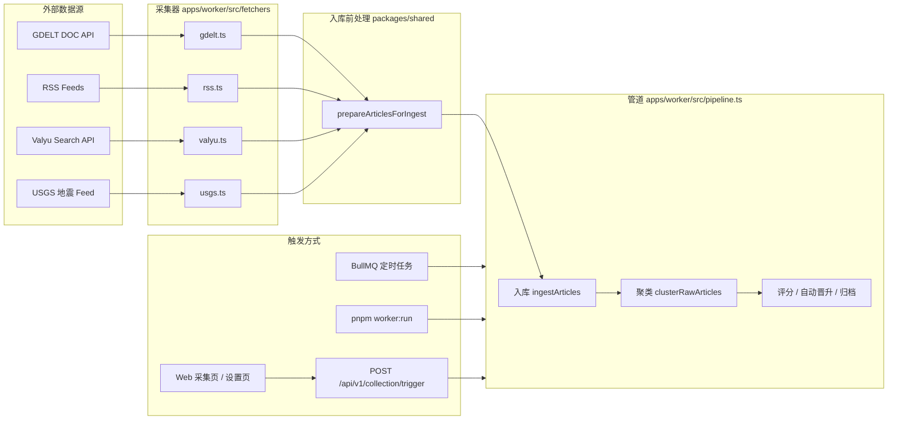
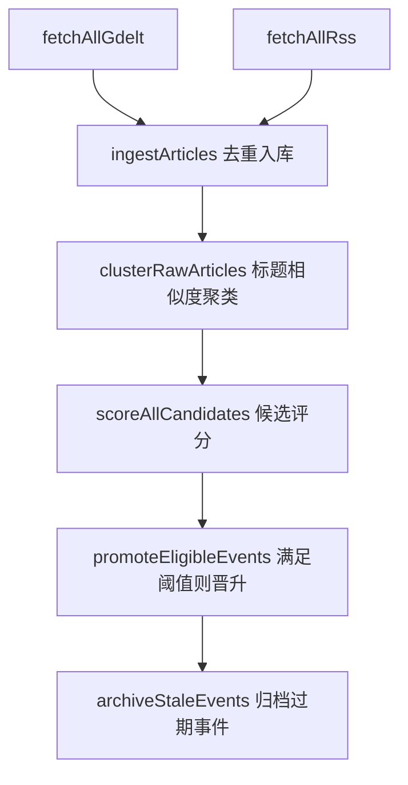

# 数据采集手段

本文档描述 **Event Timeline 当前已实现** 的数据采集方式、触发渠道与后续处理流程。内容以代码实现为准（截至 M1 数据管道阶段）。

---

## 1. 总览

系统通过 **Worker 数据管道** 从外部数据源拉取新闻文章，写入 PostgreSQL，再经聚类、评分等步骤生成候选/关注事件。采集相关代码位于 `apps/worker/`，配置常量位于 `packages/shared/`。



---

## 2. 已实现的数据源

### 2.1 GDELT DOC 2.0 API（主数据源）

| 项 | 说明 |
|----|------|
| **用途** | 全球新闻全文检索，按分类关键词批量拉取近期报道 |
| **实现** | `apps/worker/src/fetchers/gdelt.ts` |
| **API 端点** | `GDELT_DOC_URL`（默认 `https://api.gdeltproject.org/api/v2/doc/doc`） |
| **模式** | `mode=artlist`，每类最多 75 条，时间窗默认 `24h`，按日期降序 |
| **sourceType** | `gdelt_doc` |
| **入库字段** | URL、标题、域名、语言、国家、发布时间、封面图、分类 hint |

**分类与搜索词**（`packages/shared/src/constants.ts` → `GDELT_CATEGORIES`）：

| 分类 | GDELT query |
|------|-------------|
| politics | election / government / coup / sanctions / diplomatic summit |
| disaster | earthquake / flood / hurricane / wildfire / tsunami / volcano / drought |
| conflict | war / military / attack / missile strike / bombing / piracy |
| tech | AI / cyber attack / data breach / ransomware |
| economy | market crash / recession / trade war / commodity crisis / food shortage |
| society | protest / riot / unrest / crime / cartel |
| health | pandemic / outbreak / epidemic |
| environment | climate change / pollution / environmental disaster |
| sports | Olympics / World Cup / championship / tournament |
| conflict_ukraine | Ukraine / Russia / frontline / counteroffensive |
| conflict_gaza | Gaza / Hamas / ceasefire / Israel |
| conflict_redsea | Houthi / Red Sea / Yemen / shipping attack |
| conflict_sudan | Sudan / Khartoum / RSF / civil war |
| conflict_taiwan | Taiwan / Taiwan Strait / military exercise |
| conflict_dprk | North Korea / ballistic missile / DPRK |
| conflict_nuclear | nuclear threat / ballistic missile test / ICBM |

**区域热点查询**（`conflict_*` 前缀）用于覆盖持续冲突地区，替代原 Valyu 威胁主题查询，无需 API Key。

**限流与重试**：

- 每个分类请求之间默认间隔 **12 秒**（`GDELT_CATEGORY_DELAY_MS`）
- HTTP 429 时指数退避重试，最多 4 次
- 单分类失败不影响其他分类，失败记录写入 `collection_runs`

### 2.2 RSS Feeds（补充数据源）

| 项 | 说明 |
|----|------|
| **用途** | 从主流媒体 RSS 补充高质量英文报道 |
| **实现** | `apps/worker/src/fetchers/rss.ts`（基于 `rss-parser`） |
| **sourceType** | `rss` |
| **Feed 列表** | `packages/shared/src/constants.ts` → `RSS_FEEDS` |

当前配置的 Feed：

| 名称 | URL | 域名 |
|------|-----|------|
| BBC World | `https://feeds.bbci.co.uk/news/world/rss.xml` | bbc.co.uk |
| Al Jazeera | `https://www.aljazeera.com/xml/rss/all.xml` | aljazeera.com |
| The Guardian World | `https://www.theguardian.com/world/rss` | theguardian.com |
| DW News | `https://rss.dw.com/xml/rss-en-world` | dw.com |
| France 24 | `https://www.france24.com/en/rss` | france24.com |
| NPR World | `https://feeds.npr.org/1004/rss.xml` | npr.org |

**行为**：

- 请求超时 35 秒，失败最多重试 3 次（间隔 3s / 6s / 9s）
- 各 Feed 之间间隔 1.5 秒
- 缺少 `link` 或 `title` 的条目跳过；单 Feed 失败不影响其他 Feed

### 2.3 Valyu 新闻搜索（可选，非默认）

| 项 | 说明 |
|----|------|
| **用途** | 通过 [Valyu](https://valyu.ai) Search API 按威胁主题 query 补充全球新闻 |
| **实现** | `apps/worker/src/fetchers/valyu.ts` |
| **启用条件** | 环境变量 `VALYU_API_KEY` 已配置；**未配置时自动跳过（推荐）** |
| **sourceType** | `valyu` |
| **Query 列表** | `packages/shared/src/threat-queries.ts` → `VALYU_THREAT_QUERIES` |

区域热点已迁移至 GDELT `conflict_*` 分类，日常使用无需配置 Valyu。

**行为**：

- `searchType: news`，每条 query 最多 `VALYU_MAX_RESULTS`（默认 20）条，时间窗默认最近 `VALYU_LOOKBACK_DAYS`（7）天
- 排除 wikipedia.org；query 之间间隔 `VALYU_QUERY_DELAY_MS`（默认 2 秒）
- 积分不足时停止后续 query，已拉取数据仍入库

### 2.4 USGS 地震 Feed（免费）

| 项 | 说明 |
|----|------|
| **用途** | 补充近期显著地震事件（带坐标与震级） |
| **实现** | `apps/worker/src/fetchers/usgs.ts` |
| **API 端点** | `USGS_EARTHQUAKE_URL`（默认 2.5+ 震级、近 24 小时 GeoJSON） |
| **sourceType** | `usgs_earthquake` |
| **过滤** | 默认仅入库震级 ≥ `USGS_MIN_MAGNITUDE`（4.5）的事件 |

### 2.5 入库前清洗与去重

所有数据源在入库前统一经过 `packages/shared/src/article-filter.ts` → `prepareArticlesForIngest`：

| 步骤 | 说明 |
|------|------|
| 正文清洗 | 去除 skip to content、subscribe 等 boilerplate |
| 域名过滤 | 屏蔽 wikipedia.org 等低质量/非新闻源 |
| 标题过滤 | 跳过栏目页、科普聚合页等泛标题 |
| 分类推断 | 关键词表自动推断 `category_hint`（RSS 条目会覆盖原 hint） |
| 国家推断 | 从标题/摘要匹配已知地名表补充 `country` |
| 去重 | URL 归一化 + 标题精确匹配 + 标题指纹（同源重复报道） |

### 2.6 关注事件定向采集（GDELT 按事件 query）

| 项 | 说明 |
|----|------|
| **用途** | 对已晋升/关注中的事件，用其专属 GDELT 查询持续补充报道 |
| **实现** | `apps/worker/src/services/tracked.ts` |
| **数据源** | 仍走 GDELT DOC API（`fetchGdeltForQuery`） |
| **时间窗** | 默认 `7d`（比全量分类采集的 24h 更宽） |
| **触发条件** | `events.tracking_status = 'tracking'` 且 `event_queries.is_active = TRUE` 且存在 `gdelt_query` |

采集完成后会：

1. 入库新文章并关联到 `event_articles`
2. 更新事件统计与 `heat_score`
3. 写入 `last_collected_at`
4. 每个事件之间间隔 2 秒

---

## 3. 采集任务类型

Worker 通过 BullMQ 队列 `event-pipeline` 执行三类任务（`apps/worker/src/index.ts`）：

| 任务名 | 管道函数 | 说明 |
|--------|----------|------|
| `fetch` | `runFetchPipeline()` | **全量采集**：GDELT 全分类 + RSS → 入库 → 聚类 → 评分 → **自动晋升**（满足阈值）→ 归档过期事件 |
| `tracked` | `runTrackedPipeline()` | **关注事件采集**：按事件 GDELT query 补充报道 |
| `snapshot` | `runSnapshotPipeline()` | **每日快照**：为 tracking 事件生成热度与文章数快照（非外部拉取，基于已有数据） |

手动触发时还可选 `all`，依次执行 fetch → tracked → snapshot。

---

## 4. 触发方式

### 4.1 定时调度（生产推荐）

Worker 启动后从 `app_settings` 表读取 `collection_schedule`，注册 BullMQ 重复任务（`apps/worker/src/schedule.ts`）。

**默认频率**（`DEFAULT_COLLECTION_SCHEDULE`）：

| 任务 | 默认间隔 | 可选值 |
|------|----------|--------|
| 全量采集 fetch | 每 2 小时（120 分钟） | 30 / 60 / 120 / 720 / 1440 分钟 |
| 关注事件 tracked | 每 12 小时（720 分钟） | 360 / 720 / 1440 分钟 |
| 快照 snapshot | 每 24 小时 | 6 / 12 / 24 / 48 小时 |

- 在 **Web 设置页**（`/settings`）修改频率，通过 `PUT /api/v1/collection/settings` 保存
- Worker 每 **30 秒** 检测配置变更并刷新调度

启动 Worker：

```bash
pnpm --filter @event-time-line/worker dev
```

依赖 Redis（`REDIS_URL`）。

### 4.2 命令行一次性执行

适合本地开发或调试，执行完即退出：

```bash
# 默认：全量采集（GDELT + RSS）
pnpm worker:run

# 指定任务
pnpm --filter @event-time-line/worker run:once fetch
pnpm --filter @event-time-line/worker run:once tracked
pnpm --filter @event-time-line/worker run:once snapshot
pnpm --filter @event-time-line/worker run:once all
```

### 4.3 API 手动触发

| 方法 | 路径 | 说明 |
|------|------|------|
| POST | `/api/v1/collection/trigger` | Body: `{ "job": "fetch" \| "tracked" \| "snapshot" \| "all" }` |
| GET | `/api/v1/collection/runs` | 采集历史列表 |
| GET | `/api/v1/collection/runs/:id` | 单条采集详情 |
| GET/PUT | `/api/v1/collection/settings` | 读取/更新调度频率 |

并发保护：若已有任务在运行（内存或 DB 中 `status = 'running'`），返回 **409**。

实现见 `apps/api/src/routes/collection.ts`。

### 4.4 Web 界面

| 页面 | 路径 | 功能 |
|------|------|------|
| 采集记录 | `/collection` | 查看历史、手动触发 fetch / tracked / snapshot / all |
| 设置 | `/settings` | 配置三类任务的定时频率 |

---

## 5. 采集后的处理流程

全量采集（`fetch`）在拉取数据后依次执行：



**入库（`ingestArticles`）**：

- 按规范化 URL 去重，已存在则跳过
- 自动创建/关联 `sources` 表记录
- 新文章写入 `articles` 表

**聚类（`clusterRawArticles`）**：

- 基于 PostgreSQL `pg_trgm` 标题相似度
- 相似度 > 0.35 合并到已有事件；否则创建候选簇（`hotspot_candidates`）

**评分与自动晋升**：

- 全量采集结束时调用 `promoteEligibleEvents()`，阈值见 `PROMOTE_THRESHOLDS`（最少 3 源、24h 内 5 篇文章、热度 ≥ 35）
- 满足条件的候选自动进入 `tracking` 状态，并写入 `event_queries`，后续由 `tracked` 任务持续采集
- **手动晋升**（不经过 pipeline）：在候选池点击「加入关注」，调用 `POST /api/v1/candidates/:id/track`，效果与自动晋升相同，但不校验阈值

> 自动晋升**仍在使用**，尚未移除。系统说明详见 Web「系统说明」页 `/guide` 的「候选晋升」章节。

---

## 6. 环境变量

| 变量 | 默认值 | 说明 |
|------|--------|------|
| `DATABASE_URL` | — | PostgreSQL 连接 |
| `REDIS_URL` | `redis://localhost:16379` | BullMQ 队列（定时任务必需） |
| `GDELT_DOC_URL` | GDELT DOC API 地址 | 可指向代理或 mock |
| `GDELT_CATEGORY_DELAY_MS` | `12000` | GDELT 分类请求间隔（毫秒） |

---

## 7. 采集记录与观测

每次采集（或子步骤）写入 `collection_runs` 表，便于审计与排错：

| run_type | source_type | 含义 |
|----------|-------------|------|
| `fetch_all` | `mixed` | 一次完整 fetch 管道的总记录 |
| `fetch_gdelt` | `gdelt_doc` | 单个 GDELT 分类的采集结果 |
| `fetch_rss` | `rss` | RSS 全量采集结果 |
| `fetch_tracked` | `gdelt_doc` | 单个关注事件的定向采集 |

字段包括：`articles_found`、`articles_new`、`events_created`、`events_promoted`、`error_message`、`metadata`（最多 100 篇文章摘要）。

---

## 8. 尚未实现的数据源

类型定义中预留了 `gdelt_events`（`RawArticle.sourceType`），但 **当前代码未接入**。设计文档中规划、评估过的来源包括：

| 数据源 | 状态 | 参考文档 |
|--------|------|----------|
| GDELT Events 2.0 CSV | 未实现 | [数据源评估](data-sources-evaluation.md) §3 |
| Wikidata SPARQL | 未实现 | [数据源评估](data-sources-evaluation.md) §5 |
| Wikipedia Current Events | 未实现 | [数据源评估](data-sources-evaluation.md) §6 |
| Event Registry / NewsAPI | 未实现（商业备选） | [数据源评估](data-sources-evaluation.md) §7 |

扩展新采集器的一般步骤：

1. 在 `apps/worker/src/fetchers/` 新增 fetcher，输出 `RawArticle[]`
2. 在 `runFetchPipeline()` 或独立管道中调用 `ingestArticles`
3. 视需要扩展 `collection_runs.run_type` / `source_type` 枚举
4. 在 `packages/shared/src/constants.ts` 中维护 Feed / 分类等配置

---

## 9. 相关代码索引

| 模块 | 路径 |
|------|------|
| GDELT 采集器 | `apps/worker/src/fetchers/gdelt.ts` |
| RSS 采集器 | `apps/worker/src/fetchers/rss.ts` |
| 管道编排 | `apps/worker/src/pipeline.ts` |
| 关注事件采集 | `apps/worker/src/services/tracked.ts` |
| 文章入库 | `apps/worker/src/services/articles.ts` |
| 聚类 | `apps/worker/src/services/clustering.ts` |
| 定时调度 | `apps/worker/src/schedule.ts` |
| Worker 入口 | `apps/worker/src/index.ts` |
| 一次性 CLI | `apps/worker/src/run-once.ts` |
| 采集 API | `apps/api/src/routes/collection.ts` |
| 分类 / RSS 配置 | `packages/shared/src/constants.ts` |
| 调度配置 | `packages/shared/src/collection-schedule.ts` |

---

## 10. 快速验证

```bash
# 1. 确保数据库与 Redis 已启动
docker compose up -d

# 2. 跑一轮全量采集（需联网访问 GDELT 与 RSS）
pnpm worker:run

# 3. 在 Web 查看采集记录
# http://localhost:3000/collection
```

更完整的本地启动步骤见根目录 [RUN.md](../RUN.md) 与 [README.md](../README.md)。
