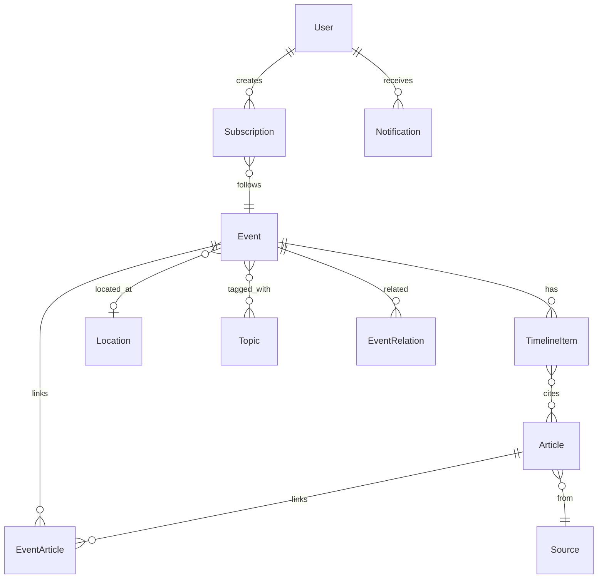

# 核心数据模型设计

## 1. 实体关系概览



## 2. 实体定义

### 2.1 Event（事件）

聚类后的热点事件，是产品的核心对象。

| 字段 | 类型 | 必填 | 说明 |
|------|------|------|------|
| id | UUID | ✓ | 主键 |
| slug | string | ✓ | URL 友好标识，如 `ukraine-ceasefire-2026` |
| title | string | ✓ | 事件标题（中文） |
| title_en | string | | 英文标题 |
| summary | text | ✓ | 一句话摘要（≤ 200 字） |
| status | enum | ✓ | `developing` / `settled` / `long_term` / `disputed` |
| confidence | enum | ✓ | `high` / `medium` / `low` |
| heat_score | float | ✓ | 热度分数，0–100 |
| article_count | int | ✓ | 关联文章数 |
| source_count | int | ✓ | 独立来源数 |
| location_id | UUID | | 主要地点 |
| first_seen_at | timestamptz | ✓ | 首次发现时间 |
| last_updated_at | timestamptz | ✓ | 最近更新时间 |
| peak_at | timestamptz | | 热度峰值时间 |
| cover_image_url | string | | 封面图（来自 VGKG 或首篇文章） |
| is_featured | boolean | | 是否编辑推荐 |
| created_at | timestamptz | ✓ | 记录创建时间 |
| updated_at | timestamptz | ✓ | 记录更新时间 |

**状态说明：**

| 状态 | 含义 |
|------|------|
| developing | 仍在发展中，持续更新 |
| settled | 事态已基本平息 |
| long_term | 长期影响中（如气候变化、战争） |
| disputed | 信息存在明显矛盾 |

### 2.2 Article（文章/报道）

单条新闻来源，不存全文。

| 字段 | 类型 | 必填 | 说明 |
|------|------|------|------|
| id | UUID | ✓ | 主键 |
| source_id | UUID | ✓ | 媒体来源 |
| external_id | string | | 外部 ID（GDELT URL hash 等） |
| url | string | ✓ | 原文链接 |
| title | string | ✓ | 原标题 |
| title_zh | string | | 中文标题（翻译） |
| snippet | text | | 摘要片段（≤ 300 字） |
| snippet_zh | text | | 中文摘要（翻译） |
| language | string | ✓ | ISO 639-1，如 `en`、`zh` |
| published_at | timestamptz | ✓ | 发布时间 |
| fetched_at | timestamptz | ✓ | 采集时间 |
| tone | float | | GDELT 情绪分数（-100 ~ +100） |
| image_url | string | | 配图 URL |
| location_id | UUID | | 报道涉及地点 |
| is_duplicate | boolean | | 是否重复（去重标记） |
| created_at | timestamptz | ✓ | |

**唯一约束：** `(url)` 或 `(external_id, source_id)`

### 2.3 TimelineItem（时间线节点）

事件发展的一个关键节点。

| 字段 | 类型 | 必填 | 说明 |
|------|------|------|------|
| id | UUID | ✓ | 主键 |
| event_id | UUID | ✓ | 所属事件 |
| occurred_at | timestamptz | ✓ | 节点发生时间 |
| title | string | ✓ | 节点标题（≤ 50 字） |
| description | text | | 节点描述（≤ 150 字） |
| node_type | enum | ✓ | 见下表 |
| importance | int | ✓ | 重要度 1–5 |
| source_article_ids | UUID[] | ✓ | 关联文章 ID 列表 |
| is_ai_generated | boolean | ✓ | 是否 AI 生成 |
| sort_order | int | ✓ | 排序权重 |
| created_at | timestamptz | ✓ | |
| updated_at | timestamptz | ✓ | |

**节点类型：**

| 类型 | 说明 | 示例 |
|------|------|------|
| outbreak | 事件爆发 | 「地震发生，震级 7.2」 |
| escalation | 事态升级 | 「死亡人数上升至 500」 |
| turning_point | 转折点 | 「双方宣布停火」 |
| official_statement | 官方声明 | 「外交部发表声明」 |
| development | 一般进展 | 「救援队伍抵达灾区」 |
| aftermath | 后续影响 | 「经济损失预估 100 亿」 |

### 2.4 Source（媒体来源）

| 字段 | 类型 | 必填 | 说明 |
|------|------|------|------|
| id | UUID | ✓ | 主键 |
| name | string | ✓ | 媒体名称 |
| domain | string | ✓ | 域名，如 `reuters.com` |
| country_code | string | | ISO 3166-1 alpha-2 |
| language | string | | 主要语言 |
| credibility_tier | enum | | `tier1` / `tier2` / `tier3` / `unknown` |
| logo_url | string | | 媒体 Logo |
| created_at | timestamptz | ✓ | |

### 2.5 Location（地点）

| 字段 | 类型 | 必填 | 说明 |
|------|------|------|------|
| id | UUID | ✓ | 主键 |
| name | string | ✓ | 地点名称 |
| name_en | string | | 英文名 |
| type | enum | ✓ | `country` / `region` / `city` / `point` |
| country_code | string | | ISO 3166-1 alpha-2 |
| latitude | float | | 纬度 |
| longitude | float | | 经度 |
| parent_id | UUID | | 上级地点（城市→国家） |
| wikidata_id | string | | Wikidata QID |
| created_at | timestamptz | ✓ | |

### 2.6 Topic（分类标签）

| 字段 | 类型 | 必填 | 说明 |
|------|------|------|------|
| id | UUID | ✓ | 主键 |
| slug | string | ✓ | 如 `politics`、`disaster` |
| name | string | ✓ | 中文名 |
| name_en | string | | 英文名 |
| icon | string | | 图标标识 |
| sort_order | int | | 排序 |

**预置分类：**

| slug | 中文 | 说明 |
|------|------|------|
| politics | 政治 | 选举、政策、外交 |
| disaster | 灾害 | 地震、洪水、台风 |
| conflict | 冲突 | 战争、武装冲突 |
| economy | 财经 | 市场、企业、贸易 |
| tech | 科技 | 产品、AI、航天 |
| health | 健康 | 疫情、医疗 |
| society | 社会 | 抗议、犯罪、民生 |
| environment | 环境 | 气候、污染 |
| sports | 体育 | 赛事、运动员 |
| culture | 文化 | 娱乐、艺术 |

### 2.7 EventArticle（事件-文章关联）

| 字段 | 类型 | 必填 | 说明 |
|------|------|------|------|
| event_id | UUID | ✓ | |
| article_id | UUID | ✓ | |
| relevance_score | float | ✓ | 相关度 0–1 |
| is_primary | boolean | | 是否主要来源 |
| created_at | timestamptz | ✓ | |

**主键：** `(event_id, article_id)`

### 2.8 EventTopic（事件-标签关联）

| 字段 | 类型 | 必填 | 说明 |
|------|------|------|------|
| event_id | UUID | ✓ | |
| topic_id | UUID | ✓ | |
| confidence | float | | 分类置信度 |

**主键：** `(event_id, topic_id)`

### 2.9 EventRelation（事件关联）

| 字段 | 类型 | 必填 | 说明 |
|------|------|------|------|
| event_id | UUID | ✓ | |
| related_event_id | UUID | ✓ | |
| relation_type | enum | ✓ | `background` / `consequence` / `parallel` / `sub_event` |
| created_at | timestamptz | ✓ | |

### 2.10 User（用户）

| 字段 | 类型 | 必填 | 说明 |
|------|------|------|------|
| id | UUID | ✓ | |
| email | string | | |
| phone | string | | |
| display_name | string | | |
| locale | string | | 默认 `zh-CN` |
| created_at | timestamptz | ✓ | |
| updated_at | timestamptz | ✓ | |

### 2.11 Subscription（订阅）

| 字段 | 类型 | 必填 | 说明 |
|------|------|------|------|
| id | UUID | ✓ | |
| user_id | UUID | ✓ | |
| event_id | UUID | ✓ | |
| notify_on_update | boolean | ✓ | 默认 true |
| created_at | timestamptz | ✓ | |

**唯一约束：** `(user_id, event_id)`

### 2.12 Notification（通知）

| 字段 | 类型 | 必填 | 说明 |
|------|------|------|------|
| id | UUID | ✓ | |
| user_id | UUID | ✓ | |
| event_id | UUID | ✓ | |
| timeline_item_id | UUID | | 触发通知的节点 |
| title | string | ✓ | |
| body | text | | |
| is_read | boolean | ✓ | 默认 false |
| created_at | timestamptz | ✓ | |

---

## 3. 热度计算模型

```
heat_score = (
    source_diversity * 0.30 +    // 来源多样性（独立媒体数）
    article_velocity * 0.25 +    // 报道增速（近 1h vs 近 6h）
    recency_decay * 0.20 +       // 时间衰减
    source_tier_weight * 0.15 +  // 权威媒体权重
    geographic_spread * 0.10     // 地理传播范围
) * 100
```

| 因子 | 计算方式 |
|------|----------|
| source_diversity | `min(source_count / 10, 1.0)` |
| article_velocity | `articles_last_1h / max(articles_last_6h, 1)` |
| recency_decay | `exp(-hours_since_last_update / 24)` |
| source_tier_weight | `avg(credibility_tier_score)` |
| geographic_spread | `min(unique_countries / 5, 1.0)` |

---

## 4. 事件聚类策略

### 4.1 输入特征

- 标题 + 摘要的文本 embedding（向量）
- 发布时间窗口（默认 ± 72 小时）
- 地点相似度
- 实体重叠（人物、组织，来自 GDELT GKG）

### 4.2 聚类规则

1. 新文章到达 → 计算与现有事件的相似度
2. 相似度 > 0.85 且时间窗口内 → 合并到已有事件
3. 相似度 0.70–0.85 → 标记为「待确认」，人工或二次聚类
4. 相似度 < 0.70 → 创建新事件（需 ≥ 2 篇相关文章才发布）

### 4.3 合并触发

- 同一事件在 24 小时内有新报道 → 更新 `last_updated_at`
- 新报道可能产生新时间线节点
- 重新计算热度和摘要

---

## 5. 索引建议

```sql
-- 事件列表查询
CREATE INDEX idx_event_heat ON events (heat_score DESC, last_updated_at DESC);
CREATE INDEX idx_event_status ON events (status, last_updated_at DESC);
CREATE INDEX idx_event_location ON events (location_id);

-- 文章去重与查询
CREATE UNIQUE INDEX idx_article_url ON articles (url);
CREATE INDEX idx_article_published ON articles (published_at DESC);
CREATE INDEX idx_article_source ON articles (source_id, published_at DESC);

-- 时间线
CREATE INDEX idx_timeline_event ON timeline_items (event_id, occurred_at DESC);

-- 全文搜索
CREATE INDEX idx_event_search ON events USING gin(to_tsvector('simple', title || ' ' || summary));

-- 订阅通知
CREATE INDEX idx_subscription_user ON subscriptions (user_id);
CREATE INDEX idx_notification_user_unread ON notifications (user_id, is_read, created_at DESC);
```
