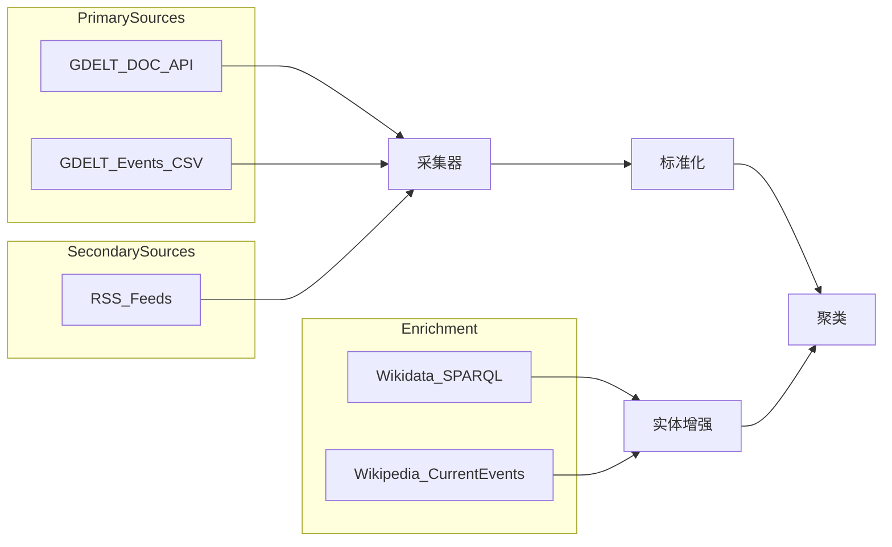

# 数据源评估报告

## 1. 评估总览

| 数据源 | 类型 | MVP 优先级 | 成本 | 推荐度 |
|--------|------|-----------|------|--------|
| GDELT DOC 2.0 API | 全球新闻全文检索 | P0 必须 | 免费 | ★★★★★ |
| GDELT Events 2.0 | 结构化事件 | P0 必须 | 免费 | ★★★★★ |
| RSS Feeds | 补充报道 | P1 推荐 | 免费 | ★★★★ |
| Wikidata SPARQL | 背景知识 | P2 可选 | 免费 | ★★★ |
| Wikipedia Current Events | 历史事件 | P2 可选 | 免费 | ★★★ |
| Event Registry API | 商业聚合 | P3 备选 | 付费 | ★★★ |
| NewsAPI.org | 商业新闻 | P3 备选 | 付费 | ★★ |

**MVP 推荐组合：GDELT DOC + GDELT Events + 精选 RSS**

---

## 2. GDELT DOC 2.0 API

### 2.1 概述

GDELT 全球最大的开放新闻监控项目，DOC 2.0 提供全文搜索 API，覆盖 65 种语言，实时机器翻译为英文。

- 官网：https://www.gdeltproject.org/
- API 端点：`https://api.gdeltproject.org/api/v2/doc/doc`
- 文档：https://blog.gdeltproject.org/gdelt-doc-2-0-api-debuts/

### 2.2 能力

| 能力 | 详情 |
|------|------|
| 搜索范围 | 滚动 3 个月窗口 |
| 语言 | 65 种语言，98.4% 非英语内容实时翻译 |
| 输出格式 | JSON、JSONP、RSS、可视化 iframe |
| 更新频率 | 约 15 分钟 |
| 图片 | 支持 VGKG 视觉知识图谱图片搜索 |
| CORS | 支持 `Access-Control-Allow-Origin: *` |

### 2.3 关键 API 参数

```
GET https://api.gdeltproject.org/api/v2/doc/doc
  ?query={搜索词}
  &mode=artlist          # 文章列表
  &maxrecords=75         # 最大返回数
  &format=json
  &timespan=24h          # 时间范围：1h, 24h, 7d, 30d
  &sort=datedesc         # 按日期降序
```

**mode 选项：**

| mode | 用途 |
|------|------|
| artlist | 文章列表（MVP 主要使用） |
| timelinevol | 报道量时间线 |
| tonechart | 情绪分布 |
| imagecollage | 图片拼贴 |

**query 高级语法：**

| 操作符 | 示例 | 说明 |
|--------|------|------|
| 精确短语 | `"earthquake"` | 引号包裹 |
| OR | `(flood OR earthquake)` | 布尔或 |
| 排除 | `-domain:example.com` | 减号排除 |
| 域名 | `domain:reuters.com` | 限定来源 |
| 语言 | `sourcelang:chinese` | 限定语言 |

### 2.4 返回字段（artlist 模式）

```json
{
  "articles": [
    {
      "url": "https://...",
      "url_mobile": "https://...",
      "title": "Article Title",
      "seendate": "20260112120000",
      "socialimage": "https://...",
      "domain": "reuters.com",
      "language": "English",
      "sourcecountry": "United States"
    }
  ]
}
```

### 2.5 频率限制

| 项目 | 说明 |
|------|------|
| 官方限制 | **无明确 API Key 要求，无文档化硬性 QPS 限制** |
| 实际建议 | 每 15 分钟轮询一次，避免秒级高频请求 |
| 单次返回 | maxrecords 最大 250 |
| 风险 | 高频抓取可能被临时封禁 IP |

### 2.6 版权边界

| 允许 | 不允许 |
|------|--------|
| 存储标题、URL、域名、发布时间 | 存储或展示全文 |
| 存储 GDELT 提供的 socialimage URL | 将 GDELT 数据转售 |
| 基于元数据做聚合分析 | 声称 GDELT 内容为原创 |

**建议：** 仅保存标题 + URL + 摘要片段（如 API 返回的 title），用户点击跳转原文。

### 2.7 MVP 使用策略

```
每 15 分钟执行：
1. 按分类关键词轮询（politics, disaster, conflict, tech, economy）
2. mode=artlist, timespan=1h, maxrecords=75
3. 去重后写入 articles 表
4. 触发聚类管道
```

---

## 3. GDELT Events 2.0

### 3.1 概述

GDELT Events 数据库记录全球新闻中提及的事件，包含 Actor、Action、Location、Tone 等结构化字段。

- 数据格式：CSV 文件（每 15 分钟更新）或 Google BigQuery
- Codebook：https://www.gdeltproject.org/data/documentation/GDELT-Event_Codebook-V2.0.pdf

### 3.2 能力

| 能力 | 详情 |
|------|------|
| 事件字段 | GlobalEventID, EventDate, Actor1/2, EventCode, GoldsteinScale, Tone 等 |
| 地理 | 国家、州、城市、经纬度 |
| 时间跨度 | 1979 年至今（2.0 格式自 2015 年起） |
| 更新 | 每 15 分钟 |
| BigQuery | `gdelt-bq.gdeltv2.events` 表 |

### 3.3 访问方式

**方式 A：CSV 下载（适合 MVP）**

```
http://data.gdeltproject.org/gdeltv2/lastupdate.txt
→ 获取最新 CSV 文件列表
→ 下载 .export.CSV.zip
```

**方式 B：BigQuery（适合规模化）**

```sql
SELECT
  GLOBALEVENTID,
  SQLDATE,
  Actor1Name,
  Actor2Name,
  EventCode,
  GoldsteinScale,
  AvgTone,
  ActionGeo_FullName,
  ActionGeo_Lat,
  ActionGeo_Long,
  SOURCEURL
FROM `gdelt-bq.gdeltv2.events`
WHERE SQLDATE >= 20260101
  AND GoldsteinScale < -5  -- 负面事件
ORDER BY SQLDATE DESC
LIMIT 100
```

### 3.4 频率与成本

| 项目 | 说明 |
|------|------|
| CSV 下载 | 免费，无限制 |
| BigQuery | 免费 tier 1TB/月查询，超出按量计费 |
| 数据量 | 每日约 30 万+ 事件记录 |

### 3.5 MVP 使用策略

- 用 Events 数据做 **热点发现** 和 **地理标注**
- 用 DOC API 做 **文章详情** 和 **时间线来源**
- Events 的 `SOURCEURL` 关联到 Article 表

---

## 4. RSS Feeds

### 4.1 概述

RSS 是补充 GDELT 的重要来源，可获取特定媒体的最新报道。

### 4.2 推荐 Feed 列表

| 媒体 | Feed URL | 语言 | 分类 |
|------|----------|------|------|
| Reuters | `https://www.reutersagency.com/feed/` | EN | 综合 |
| BBC News | `http://feeds.bbci.co.uk/news/world/rss.xml` | EN | 国际 |
| AP News | `https://rsshub.app/apnews/topics/apf-topnews` | EN | 综合 |
| Al Jazeera | `https://www.aljazeera.com/xml/rss/all.xml` | EN | 国际 |
| 新华网 | `http://www.xinhuanet.com/politics/news_politics.xml` | ZH | 政治 |
| Google News | `https://news.google.com/rss/search?q={keyword}&hl=zh-CN` | 多语 | 搜索 |

### 4.3 技术要点

| 项目 | 说明 |
|------|------|
| 解析库 | Node: `rss-parser`；Python: `feedparser` |
| 更新频率 | 每 30 分钟拉取 |
| 去重 | 按 URL 或 GUID |
| 限制 | 部分 Feed 有频率限制或需要 User-Agent |

### 4.4 版权边界

| 允许 | 不允许 |
|------|--------|
| 读取 title、link、pubDate、description（摘要） | 存储全文 |
| 展示标题 + 链接 | 移除来源署名 |

### 4.5 风险

- Feed 可能随时变更 URL 或停止服务
- Google News RSS 有反爬限制
- 需要维护 Feed 列表的可用性

---

## 5. Wikidata SPARQL

### 5.1 概述

Wikidata 提供结构化知识，可用于补充事件背景、地点、人物实体。

- 端点：`https://query.wikidata.org/sparql`
- GUI：https://query.wikidata.org/

### 5.2 能力示例

**查询某地点的 Wikidata 实体：**

```sparql
SELECT ?item ?itemLabel ?coord WHERE {
  ?item wdt:P31 wd:Q515;          # instance of city
        rdfs:label "Kyiv"@en.
  OPTIONAL { ?item wdt:P625 ?coord. }
  SERVICE wikibase:label { bd:serviceParam wikibase:language "en,zh". }
}
LIMIT 1
```

**查询人物信息：**

```sparql
SELECT ?person ?personLabel ?position WHERE {
  ?person wdt:P31 wd:Q5;            # instance of human
        rdfs:label "Volodymyr Zelenskyy"@en.
  OPTIONAL { ?person wdt:P39 ?position. }
  SERVICE wikibase:label { bd:serviceParam wikibase:language "en,zh". }
}
```

### 5.3 频率限制

| 项目 | 说明 |
|------|------|
| 查询超时 | 60 秒 |
| 结果限制 | 建议 LIMIT ≤ 10000 |
| 频率 | 无硬性限制，但应合理使用 |
| User-Agent | **必须设置**，否则 403 |

### 5.4 MVP 使用策略

- 用于地点标准化（城市名 → 经纬度 + Wikidata ID）
- 用于人物/组织背景卡片（V2 功能）
- 不作为主要新闻来源

---

## 6. Wikipedia Current Events

### 6.1 概述

Wikipedia 的「Current events」页面提供结构化近期事件记录。

- 页面：https://en.wikipedia.org/wiki/Portal:Current_events
- 数据：MediaWiki API 可获取

### 6.2 能力

| 能力 | 详情 |
|------|------|
| 格式 | 按日期组织的事件列表 |
| 语言 | 多语言版本 |
| 结构化 | 部分事件有 Wikidata 链接 |
| 更新 | 志愿者编辑，延迟几小时到一天 |

### 6.3 限制

- 非实时，不适合突发新闻
- 覆盖偏向西方视角
- 适合作为 **历史事件补充** 和 **冷启动种子数据**

### 6.4 版权

- CC BY-SA 3.0
- 使用时需注明来源
- 可存储结构化摘要，需保留署名

---

## 7. 商业备选（V2+）

### 7.1 Event Registry

- 官网：https://eventregistry.org/
- 特点：专业新闻事件聚类，多语言，API 友好
- 定价：免费 tier 2000 tokens/月，付费 $90+/月
- 优势：聚类质量高，省去自建聚类
- 劣势：成本、依赖第三方

### 7.2 NewsAPI.org

- 官网：https://newsapi.org/
- 特点：70,000+ 来源，简单 REST API
- 定价：免费 100 req/day，付费 $449/月
- 优势：接入简单
- 劣势：免费额度极低，无事件聚类

---

## 8. 数据源架构建议



---

## 9. 风险与缓解

| 风险 | 影响 | 缓解措施 |
|------|------|----------|
| GDELT API 不可用 | 数据中断 | 缓存最近数据 + RSS 降级 |
| GDELT 无 API Key 机制 | IP 封禁 | 控制频率，准备备用 IP/代理 |
| RSS Feed 失效 | 来源减少 | 定期检测 Feed 可用性 |
| 新闻版权投诉 | 法律风险 | 仅存元数据，跳转原文 |
| 多语言翻译质量 | 摘要失真 | 保留原文链接，标注机器翻译 |
| 聚类错误 | 用户体验差 | 低置信度标记 + 最小来源数门槛 |

---

## 10. MVP 数据采集计划

| 阶段 | 数据源 | 频率 | 优先级 |
|------|--------|------|--------|
| Week 1 | GDELT DOC artlist | 每 15 min | P0 |
| Week 1 | GDELT Events CSV | 每 15 min | P0 |
| Week 2 | Reuters + BBC RSS | 每 30 min | P1 |
| Week 2 | Google News RSS（关键词） | 每 30 min | P1 |
| Week 3 | Wikidata 地点增强 | 按需 | P2 |
| Week 4 | Wikipedia Current Events | 每日 | P2 |
