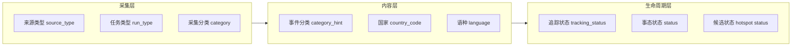

# 数据筛选维度说明

本文档专门描述拾光纪中**数据的筛选维度**：每个维度代表什么、数据从哪来、在哪些页面/API 可用，以及维度之间如何联动。

> 相关文档：[数据模型](data-model.md) · [MVP 数据流](mvp-flow.md) · [数据源评估](data-sources-evaluation.md)

---

## 1. 维度总览

系统将筛选维度分为三层：

| 层级 | 说明 | 典型用途 |
|------|------|----------|
| **采集维度** | 数据进入系统时的来源与通道标签 | 采集任务归类、监控大屏统计 |
| **内容维度** | 文章 / 事件上的语义与地理标签 | 候选池筛选、热度计算 |
| **生命周期维度** | 事件在流水线中的阶段状态 | 首页、候选池、归档分流 |



---

## 2. 内容维度（用户最常筛选）

### 2.1 事件分类 `category` / `category_hint`

**含义**：事件或文章所属的主题类型（政治、冲突、灾害等）。

**取值来源**：

| 来源 | 写入时机 | 说明 |
|------|----------|------|
| GDELT 分类采集 | 文章入库时 | 按 `GDELT_CATEGORIES` 预设查询词采集，写入 `articles.category_hint` |
| RSS 采集 | 文章入库时 | 统一标记为 `rss` |
| 关注事件采集 | 文章入库时 | 统一标记为 `tracked` |
| 事件聚类 | 创建/更新事件时 | 继承关联文章的 `category_hint`，写入 `events.category_hint`、`hotspot_candidates.category_hint` |

**当前已接入 GDELT 的分类**（`packages/shared/src/constants.ts`）：

| 值 | 中文 | GDELT 查询关键词示例 |
|----|------|----------------------|
| `politics` | 政治 | election, government, parliament, president |
| `disaster` | 灾害 | earthquake, flood, hurricane, wildfire, tsunami |
| `conflict` | 冲突 | war, military, attack, ceasefire, airstrike |
| `tech` | 科技 | artificial intelligence, cyber attack, data breach |
| `economy` | 财经 | market crash, recession, trade war, inflation |
| `rss` | RSS | RSS 订阅源文章 |
| `tracked` | 关注 | 已关注事件的定向采集 |

**数据库字段**：

- `articles.category_hint`
- `events.category_hint`
- `hotspot_candidates.category_hint`
- `collection_runs.category`（记录本次采集所属分类）

**前端展示**：`apps/web/src/app/candidates/candidateLabels.ts` 中的 `CATEGORY_LABELS`

---

### 2.2 国家 / 地区 `country`

**含义**：事件相关报道的主要国家或地区，使用 ISO 3166-1 alpha-2 两位代码（如 `US`、`CN`、`UA`）。

**取值来源**：

| 来源 | 字段 | 说明 |
|------|------|------|
| GDELT 文章 | `articles` → `sources.country_code` | 来自 GDELT `sourcecountry`，入库时规范化 |
| 媒体来源 | `sources.country_code` | 按域名 / 来源元数据推断或补全 |

**候选池中的计算方式**（主导国家）：

对某一候选事件，统计其关联文章中各 `sources.country_code` 的出现次数，**取次数最多的国家**作为该候选的「主导国家」，用于筛选。

```sql
-- 简化逻辑：按关联文章的国家代码计数，取 TOP 1
SELECT s.country_code
FROM event_articles ea
JOIN articles a ON a.id = ea.article_id
JOIN sources s ON s.id = a.source_id
WHERE ea.event_id = :event_id AND s.country_code IS NOT NULL
GROUP BY s.country_code
ORDER BY COUNT(*) DESC
LIMIT 1
```

列表展示时还会附带 `country_codes`（该事件涉及的全部国家，去重排序）。

**前端展示**：`countryLabel()` 使用 `Intl.DisplayNames` 自动转中文国名。

---

### 2.3 语种 `language`

**含义**：事件相关报道的主要语言，取 ISO 639-1 两位代码（如 `en`、`zh`、`ar`）。

**取值来源**：

- GDELT 文章自带 `language` 字段
- 入库时写入 `articles.language`

**候选池中的计算方式**（主导语种）：

与主导国家类似，对关联文章的 `language` 取前两位小写后计数，**取次数最多的语种**作为筛选依据。

```sql
SELECT lower(left(a.language, 2)) AS language_code
FROM event_articles ea
JOIN articles a ON a.id = ea.article_id
WHERE ea.event_id = :event_id AND a.language IS NOT NULL
GROUP BY lower(left(a.language, 2))
ORDER BY COUNT(*) DESC
LIMIT 1
```

**前端已知语种标签**：

| 代码 | 中文 |
|------|------|
| `en` | 英语 |
| `zh` | 中文 |
| `ar` | 阿拉伯语 |
| `fr` | 法语 |
| `de` | 德语 |
| `es` | 西班牙语 |
| `ru` | 俄语 |
| `ja` | 日语 |
| `ko` | 韩语 |

未在映射表中的代码，前端回退显示大写原文（如 `PT`）。

---

## 3. 生命周期维度

### 3.1 追踪状态 `tracking_status`

事件在系统中的**主流程阶段**，决定事件出现在哪个列表。

| 值 | 中文 | 含义 | 默认展示位置 |
|----|------|------|--------------|
| `candidate` | 候选 | 新聚类事件，观察期 | 候选池 `/candidates` |
| `tracking` | 关注中 | 管理员从候选池或热榜确认追踪后，持续采集；登录用户可订阅 | 热点 `/hot`、我的关注 `/` |
| `archived` | 已归档 | 不再主动采集（如 7 天无新报道） | 暂无独立列表 |

对应 `hotspot_candidates.status`：

| 值 | 说明 |
|----|------|
| `open` | 开放候选，出现在候选池 |
| `promoted` | 已晋升关注 |
| `archived` | 已归档 |

**候选 → 关注中（追踪）** 当前以管理员确认为主，均会将 `tracking_status` 设为 `tracking` 并写入 `event_queries`：

| 路径 | 触发时机 | 是否校验阈值 | 入口 |
|------|----------|--------------|------|
| 候选池追踪 | 管理员在候选池操作 | 否，热度分仅辅助判断 | `POST /api/v1/candidates/:id/track` |
| 热榜追踪 | 管理员在热榜操作 | 否，按热榜条目创建或关联事件 | `POST /api/v1/hot-trends/track` |

> 当前 Worker 只负责候选评分和过期归档，不再绕过管理员自动追踪候选。登录用户的「订阅」是个人行为，不改变事件的 `tracking_status`。

### 3.2 事态状态 `status`

描述事件**本身的发展阶段**（与追踪状态正交）：

| 值 | 中文 | 含义 |
|----|------|------|
| `developing` | 发展中 | 仍在持续更新 |
| `settled` | 已平息 | 事态基本结束 |
| `long_term` | 长期影响 | 如战争、气候变化等长线议题 |
| `disputed` | 存疑 | 信息存在明显矛盾 |

> 当前前端**未提供**按事态状态筛选的 UI，仅在事件详情页展示。

---

## 4. 采集与运维维度

用于采集记录、监控大屏，描述**数据是怎么进来的**。

### 4.1 任务类型 `run_type`

| 值 | 中文 | 说明 |
|----|------|------|
| `fetch_all` | 全量采集 | GDELT 全分类 + RSS 一次跑完 |
| `fetch_gdelt` | GDELT 分类 | 单个 GDELT 分类采集 |
| `fetch_rss` | RSS 订阅 | RSS 源采集 |
| `fetch_tracked` / `tracked` | 关注事件 | 对已关注事件定向采集 |
| `snapshot` | 每日快照 | 生成事件日快照 |

### 4.2 来源类型 `source_type`

| 值 | 中文 | 说明 |
|----|------|------|
| `gdelt_doc` | GDELT | GDELT DOC API |
| `rss` | RSS | RSS 订阅 |
| `mixed` | 混合 | 多来源混合任务 |

### 4.3 采集状态 `status`（collection_runs）

| 值 | 中文 |
|----|------|
| `running` | 运行中 |
| `completed` | 已完成 |
| `failed` | 失败 |

### 4.4 媒体可信度 `credibility_tier`

不参与列表筛选，但参与**热度计算**（`source_tier` 因子）：

| 值 | 得分 | 说明 |
|----|------|------|
| `tier1` | 1.0 | 主流权威媒体 |
| `tier2` | 0.7 | 知名媒体 |
| `tier3` | 0.4 | 一般来源 |
| `unknown` | 0.3 | 未分级 |

---

## 5. 各页面的筛选能力

### 5.1 候选池 `/candidates` ✅ 已实现

支持**三个内容维度的交叉筛选**，并在页面上以 Facet 芯片展示可选值及数量。

| 维度 | URL 参数 | 示例 | 说明 |
|------|----------|------|------|
| 分类 | `category` | `?category=conflict` | 精确匹配 `category_hint` |
| 国家 | `country` | `?country=US` | 匹配主导国家，大写两位 |
| 语种 | `language` | `?language=en` | 匹配主导语种，小写两位 |

**组合示例**：

```
/candidates?category=conflict&country=UA
/candidates?language=zh&category=politics
/candidates
```

**排序**：固定按 `heat_score DESC`（热度从高到低），筛选不改变排序。

**API**：`GET /api/v1/candidates`

```http
GET /api/v1/candidates?category=conflict&country=US&language=en&limit=30&offset=0
```

**响应中的 facets**（随当前筛选条件动态变化）：

```json
{
  "candidates": [ ... ],
  "total": 12,
  "facets": {
    "categories": [{ "value": "conflict", "count": 8 }, ...],
    "countries":  [{ "value": "US", "count": 5 }, ...],
    "languages":  [{ "value": "en", "count": 10 }, ...]
  }
}
```

**Facet 联动规则**：

- 切换「分类」时，国家 / 语种 Facet 会按当前分类重新计数
- 切换「国家」时，分类 / 语种 Facet 会联动更新
- 三个维度为 **AND** 关系，同时生效

**数据范围**：仅 `hotspot_candidates.status = 'open'` 且 `events.tracking_status = 'candidate'` 的记录。

---

### 5.2 关注中首页 `/` ⚠️ 部分实现

| 能力 | 参数 | 状态 |
|------|------|------|
| 排序 | `sort=heat \| recent \| updated` | ✅ API 已支持 |
| 分类筛选 | `category` | ❌ 未实现 |
| 国家筛选 | `country` | ❌ 未实现 |
| 语种筛选 | `country` | ❌ 未实现 |

**数据范围**：固定 `tracking_status = 'tracking'`。

**API**：`GET /api/v1/events?sort=heat&limit=30`

---

### 5.3 采集记录 `/collection` ⚠️ 仅展示

列表展示全部采集任务，**暂无前端筛选控件**。数据本身带有以下可筛选字段，供后续扩展：

- `run_type` — 任务类型
- `source_type` — 来源类型
- `category` — 采集分类
- `status` — 运行状态

**API**：`GET /api/v1/collection/runs?limit=50&offset=0`

---

### 5.4 监控大屏 `/dashboard` 📊 聚合统计

不做交互式筛选，但按维度**聚合展示**：

| 展示块 | 维度 | 时间范围 |
|--------|------|----------|
| 24h 分类采集 | `collection_runs.category` | 近 24 小时 |
| 热度 TOP · 关注中 | `tracking_status = tracking` | 当前 |
| 热度 TOP · 候选池 | `hotspot_candidates.status = open` | 当前 |
| 近 7 日入库趋势 | `articles.fetched_at` 按日 | 近 7 天 |

**API**：`GET /api/v1/stats/dashboard`

---

### 5.5 事件详情 `/events/[slug]`

无筛选，展示单个事件的完整信息。候选事件详情页返回链接指向候选池。

---

## 6. 筛选维度与数据表映射

| 维度 | 主要存储表.字段 | 筛选粒度 |
|------|-----------------|----------|
| 分类 | `events.category_hint` / `hotspot_candidates.category_hint` | 事件级 |
| 国家 | `sources.country_code`（经 `event_articles` 聚合） | 事件级（主导国） |
| 语种 | `articles.language`（经 `event_articles` 聚合） | 事件级（主导语种） |
| 追踪状态 | `events.tracking_status` | 事件级 |
| 事态状态 | `events.status` | 事件级 |
| 热度 | `events.heat_score` / `hotspot_candidates.heat_score` | 排序用 |
| 采集分类 | `collection_runs.category` | 任务级 |
| 任务类型 | `collection_runs.run_type` | 任务级 |
| 来源类型 | `collection_runs.source_type` / `articles` 入库来源 | 任务级 / 文章级 |

---

## 7. 设计约定

### 7.1 参数格式

| 维度 | 格式 | 大小写 |
|------|------|--------|
| `category` | 小写英文 slug | 原样，如 `politics` |
| `country` | ISO 3166-1 alpha-2 | API 入参大小写均可，内部转 **大写** |
| `language` | ISO 639-1 | API 入参大小写均可，内部取前两位转 **小写** |

### 7.2 「主导值」vs「全部值」

- **筛选**：使用「主导国家 / 主导语种」（关联文章中占比最高的值）
- **展示**：候选卡片上可展示 `country_codes` 全部涉及国家

这样可避免一篇跨国事件因次要国家报道而被错误筛出，同时保持筛选语义清晰。

### 7.3 Facet 计数

Facet 的 `count` 表示**在当前已选筛选条件下**，该维度各取值的候选数量。未出现的取值不会出现在 Facet 列表中。

### 7.4 空值处理

- 无 `category_hint` 的候选：不出现在分类 Facet 中，也无法被 `?category=` 命中
- 无国家 / 语种信息的候选：不出现在对应 Facet 中，也无法被 `?country=` / `?language=` 命中

---

## 8. 后续可扩展维度

以下维度在数据模型或采集链路中已有基础，但尚未接入列表筛选 UI：

| 维度 | 字段 / 来源 | 潜在场景 |
|------|-------------|----------|
| 时间范围 | `first_seen_at` / `last_updated_at` / `published_at` | 按发现时间、更新时间筛选 |
| 热度区间 | `heat_score` | 高热度快筛 |
| 来源数量 | `source_count` | 多源验证事件 |
| 文章数量 | `article_count` | 报道充分度 |
| 事态状态 | `events.status` | 发展中 / 已平息 |
| 媒体可信度 | `sources.credibility_tier` | 权威来源事件 |
| 地点 | `locations` / `location_id` | 地理区域筛选 |
| 主题标签 | `topics` / `event_topics` | 细粒度话题（数据库已预置 10 类） |

扩展新筛选维度时，建议同步更新：

1. 本文档 §2 / §5
2. API `querystring` schema 与 Facet 查询
3. 前端 `CandidateFilters`（或对应页面的 Filter 组件）
4. `packages/shared` 中的类型定义

---

## 9. 快速参考

```bash
# 候选池：冲突类 + 乌克兰主导报道
GET /api/v1/candidates?category=conflict&country=UA

# 候选池：中文语种的政治事件
GET /api/v1/candidates?category=politics&language=zh

# 关注中：按最近更新排序
GET /api/v1/events?sort=updated&limit=20

# 采集记录（暂无筛选参数）
GET /api/v1/collection/runs?limit=50

# 监控统计
GET /api/v1/stats/dashboard
```

**前端入口**：

| 页面 | 路径 | 可用筛选 |
|------|------|----------|
| 候选池 | `/candidates` | 分类 · 国家 · 语种 |
| 关注中 | `/` | 排序（热度 / 最新 / 更新） |
| 采集记录 | `/collection` | — |
| 监控大屏 | `/dashboard` | —（只读聚合） |
