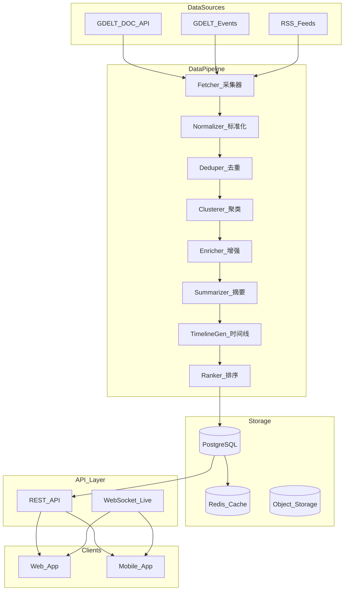
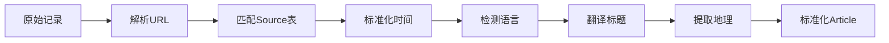
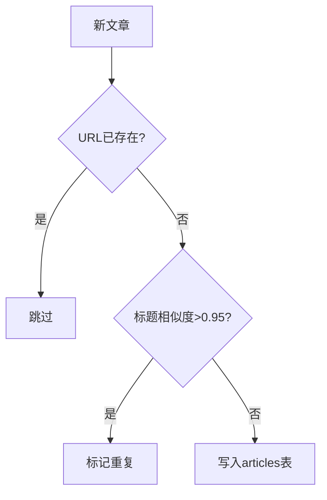
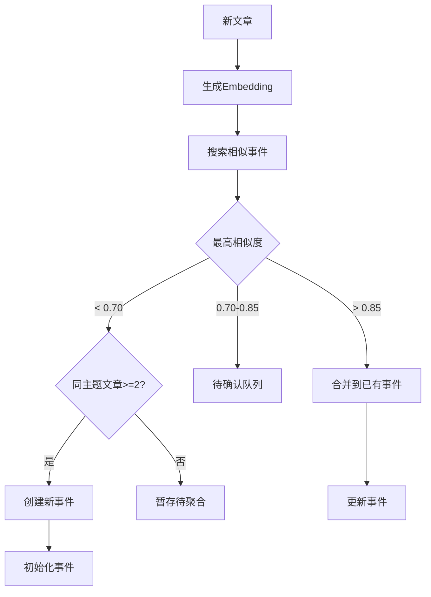
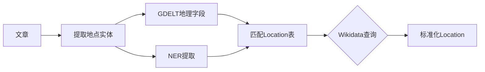
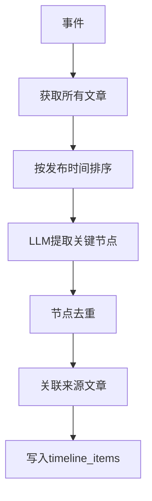
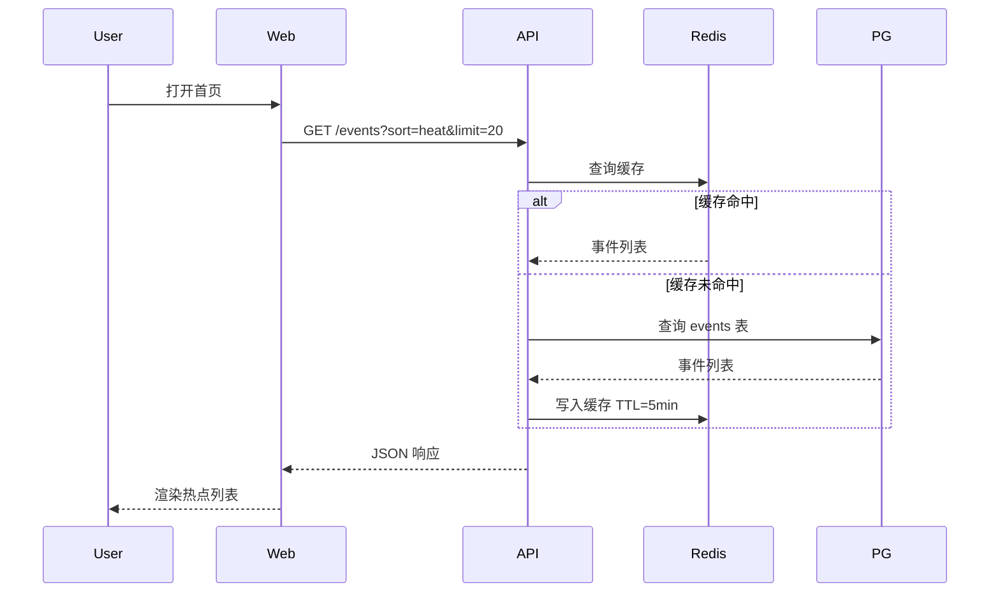
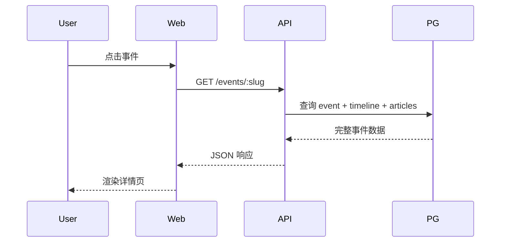
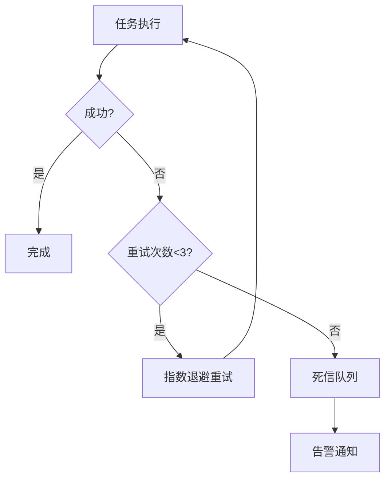

# MVP 数据流设计

## 1. 系统架构总览



---

## 2. 采集流程（Fetcher）

### 2.1 调度策略

```mermaid
gantt
    title 采集调度时间线
    dateFormat HH:mm
    axisFormat %H:%M

    section GDELT_DOC
    分类轮询_politics     :00:00, 15min
    分类轮询_disaster     :00:05, 15min
    分类轮询_conflict     :00:10, 15min
    分类轮询_tech         :00:15, 15min

    section GDELT_Events
    CSV下载解析           :00:02, 15min

    section RSS
    Feed拉取              :00:00, 30min
```



### 2.2 GDELT DOC 采集伪代码

```python
CATEGORIES = {
    "politics": '("election" OR "government" OR "parliament")',
    "disaster": '("earthquake" OR "flood" OR "hurricane" OR "wildfire")',
    "conflict": '("war" OR "military" OR "attack" OR "ceasefire")',
    "tech": '("artificial intelligence" OR "startup" OR "cyber")',
    "economy": '("market crash" OR "recession" OR "trade war")',
}

async def fetch_gdelt_doc():
    for category, query in CATEGORIES.items():
        params = {
            "query": query,
            "mode": "artlist",
            "maxrecords": 75,
            "format": "json",
            "timespan": "1h",
            "sort": "datedesc",
        }
        response = await http_get(GDELT_DOC_URL, params)
        articles = response["articles"]
        await queue.publish("normalize", {
            "source": "gdelt_doc",
            "category": category,
            "articles": articles,
        })
```

### 2.3 采集输出

每条原始记录进入 `raw_articles` 队列：

```json
{
  "source_type": "gdelt_doc",
  "external_id": "hash(url)",
  "url": "https://reuters.com/...",
  "title": "Earthquake hits...",
  "domain": "reuters.com",
  "language": "English",
  "country": "United States",
  "published_at": "2026-01-12T12:00:00Z",
  "image_url": "https://...",
  "category_hint": "disaster",
  "fetched_at": "2026-01-12T12:15:00Z"
}
```

---

## 3. 标准化流程（Normalizer）

### 3.1 处理步骤



### 3.2 标准化规则

| 字段 | 规则 |
|------|------|
| url | 去除 tracking 参数（utm_*） |
| title | trim，去除 HTML 实体 |
| published_at | 统一为 UTC ISO 8601 |
| language | ISO 639-1 映射 |
| source_id | 按 domain 匹配 Source 表，不存在则创建 |
| title_zh | 非中文标题调用翻译 API |

### 3.3 Source 自动创建

```python
def resolve_source(domain: str) -> Source:
    source = db.find_source_by_domain(domain)
    if not source:
        source = Source(
            name=guess_name_from_domain(domain),
            domain=domain,
            credibility_tier="unknown",
        )
        db.insert(source)
    return source
```

---

## 4. 去重流程（Deduper）

### 4.1 去重策略



### 4.2 去重维度

| 维度 | 方法 | 阈值 |
|------|------|------|
| URL 精确匹配 | hash(url) | 100% |
| 标题相似度 | cosine similarity on embedding | > 0.95 |
| 时间窗口 | 同一标题 ± 1 小时 | 辅助判断 |

---

## 5. 聚类流程（Clusterer）

### 5.1 聚类架构



### 5.2 Embedding 生成

```python
async def generate_embedding(text: str) -> list[float]:
    # 使用 text-embedding-3-small 或本地模型
    response = await openai.embeddings.create(
        model="text-embedding-3-small",
        input=text[:8000],
    )
    return response.data[0].embedding
```

### 5.3 相似度搜索

```sql
-- 使用 pgvector 扩展
SELECT event_id, 1 - (embedding <=> $1) AS similarity
FROM event_embeddings
WHERE 1 - (embedding <=> $1) > 0.70
ORDER BY similarity DESC
LIMIT 5;
```

### 5.4 事件创建条件

| 条件 | 要求 |
|------|------|
| 最低文章数 | ≥ 2 篇不同来源 |
| 时间窗口 | 首篇文章 72 小时内 |
| 来源多样性 | ≥ 2 个不同 domain |
| 或 GDELT Event | 有对应 GDELT Event ID 且 GoldsteinScale 显著 |

### 5.5 事件合并逻辑

```python
async def merge_article_to_event(article: Article, event: Event):
    # 1. 创建关联
    db.insert_event_article(event.id, article.id, relevance_score)

    # 2. 更新计数
    event.article_count += 1
    event.source_count = count_unique_sources(event.id)
    event.last_updated_at = now()

    # 3. 重新计算 embedding（加权平均）
    event.embedding = weighted_avg_embeddings(event.id)

    # 4. 触发后续管道
    await queue.publish("summarize", {"event_id": event.id})
    await queue.publish("timeline", {"event_id": event.id})
    await queue.publish("rank", {"event_id": event.id})
```

---

## 6. 增强流程（Enricher）

### 6.1 地理增强



### 6.2 分类标注

```python
async def classify_event(event: Event) -> list[Topic]:
    prompt = f"""
    根据以下事件信息，从预置分类中选择最匹配的 1-3 个：
    分类：politics, disaster, conflict, economy, tech, health, society, environment
    
    标题：{event.title}
    摘要：{event.summary}
    
    返回 JSON: {{"topics": ["slug1", "slug2"], "confidence": 0.85}}
    """
    result = await llm.complete(prompt)
    return resolve_topics(result.topics)
```

---

## 7. 摘要生成（Summarizer）

### 7.1 触发条件

- 新事件创建
- 事件合并新文章后（距上次摘要 > 30 分钟）
- 文章数增加 ≥ 3 篇

### 7.2 摘要 Prompt

```python
SUMMARY_PROMPT = """
你是一个新闻编辑。根据以下关于同一事件的多篇报道，生成：

1. title: 事件标题（中文，≤ 30 字）
2. summary: 一句话摘要（中文，≤ 100 字）
3. status: 事件状态（developing/settled/long_term/disputed）

要求：
- 客观中立，不加入主观判断
- 基于事实，不推测
- 如果来源存在明显矛盾，status 设为 disputed

报道列表：
{articles}

返回 JSON 格式。
"""
```

### 7.3 输出示例

```json
{
  "title": "土耳其发生7.2级地震 数百人伤亡",
  "summary": "1月12日土耳其东部发生7.2级地震，已造成至少200人遇难，救援工作正在进行中。",
  "status": "developing",
  "confidence": "medium"
}
```

---

## 8. 时间线生成（TimelineGen）

### 8.1 流程



### 8.2 时间线 Prompt

```python
TIMELINE_PROMPT = """
根据以下按时间排列的报道，提取关键发展节点。

要求：
- 每个节点 ≤ 50 字
- 只提取有新闻价值的关键进展
- 标注节点类型：outbreak/escalation/turning_point/official_statement/development/aftermath
- 标注重要度 1-5
- 关联来源文章编号

报道（按时间排序）：
{articles_with_index}

返回 JSON:
{
  "nodes": [
    {
      "occurred_at": "2026-01-12T10:00:00Z",
      "title": "地震发生",
      "description": "土耳其东部发生7.2级地震",
      "node_type": "outbreak",
      "importance": 5,
      "source_indices": [0, 1, 2]
    }
  ]
}
"""
```

### 8.3 增量更新

- 新文章到达时，仅分析新文章 + 最近 3 个节点
- 避免每次都重新生成全部时间线
- 新节点 importance ≥ 3 时触发订阅通知

---

## 9. 排序流程（Ranker）

### 9.1 热度计算

```python
def calculate_heat_score(event: Event) -> float:
    source_diversity = min(event.source_count / 10, 1.0)

    articles_1h = count_articles(event.id, hours=1)
    articles_6h = count_articles(event.id, hours=6)
    article_velocity = articles_1h / max(articles_6h, 1)

    hours_since = (now() - event.last_updated_at).hours
    recency_decay = math.exp(-hours_since / 24)

    tier_scores = {"tier1": 1.0, "tier2": 0.7, "tier3": 0.4, "unknown": 0.3}
    source_tier = avg([tier_scores[s.credibility_tier] for s in event.sources])

    countries = count_unique_countries(event.id)
    geographic_spread = min(countries / 5, 1.0)

    return (
        source_diversity * 0.30 +
        article_velocity * 0.25 +
        recency_decay * 0.20 +
        source_tier * 0.15 +
        geographic_spread * 0.10
    ) * 100
```

### 9.2 排序更新

- 每次事件更新后重新计算
- 每 15 分钟批量重算所有 developing 事件
- 结果写入 Redis 缓存（首页列表）

---

## 10. API 与展示流程

### 10.1 核心 API 端点

| 方法 | 路径 | 说明 |
|------|------|------|
| GET | `/api/v1/events` | 热点事件列表 |
| GET | `/api/v1/events/:slug` | 事件详情 |
| GET | `/api/v1/events/:slug/timeline` | 事件时间线 |
| GET | `/api/v1/search` | 搜索事件 |
| GET | `/api/v1/topics` | 分类列表 |
| POST | `/api/v1/subscriptions` | 订阅事件 |
| GET | `/api/v1/notifications` | 通知列表 |

### 10.2 首页数据流



### 10.3 事件详情数据流



---

## 11. 任务队列设计

### 11.1 队列列表

| 队列名 | 触发 | 并发 | 超时 |
|--------|------|------|------|
| `fetch:gdelt_doc` | cron 15min | 1 | 5min |
| `fetch:gdelt_events` | cron 15min | 1 | 5min |
| `fetch:rss` | cron 30min | 3 | 3min |
| `normalize` | fetch 完成 | 5 | 30s |
| `dedupe` | normalize 完成 | 5 | 10s |
| `cluster` | dedupe 完成 | 3 | 60s |
| `enrich` | cluster 完成 | 3 | 30s |
| `summarize` | enrich 完成 | 2 | 60s |
| `timeline` | summarize 完成 | 2 | 60s |
| `rank` | timeline 完成 | 1 | 30s |
| `notify` | timeline 新节点 | 3 | 10s |

### 11.2 错误处理



---

## 12. 监控指标

| 指标 | 告警阈值 |
|------|----------|
| 采集成功率 | < 95% |
| 采集延迟 | > 20 min |
| 聚类队列积压 | > 100 |
| LLM 调用失败率 | > 5% |
| API P99 延迟 | > 2s |
| 活跃事件数 | < 10（可能管道故障） |
| 平均每事件来源数 | < 3 |
